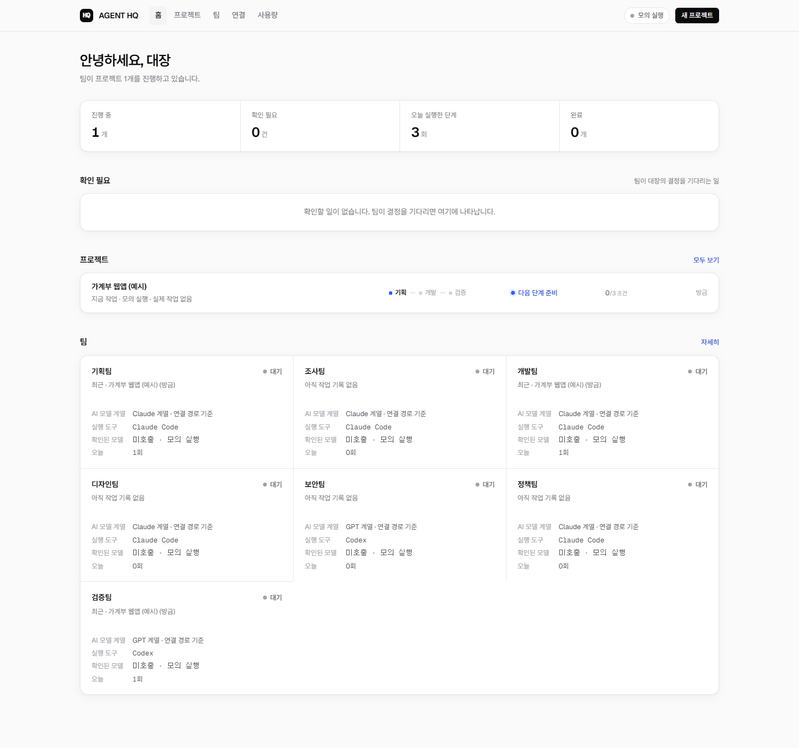

# AGENT HQ

AI 팀이 프로젝트를 **기획 → 개발 → 검증**으로 돌아가며 진행하는 로컬 작업 공간입니다.
실행 도구는 이 컴퓨터에 로그인된 Claude Code CLI와 Codex CLI를 그대로 씁니다(구독 전용, 종량제 API 차단).

## 화면

> 아래 화면은 **모의 실행 예시**입니다. 실제 AI를 호출하지 않은 임시 서버에 예시 프로젝트 하나를 넣어 찍었습니다.
> 오른쪽 위 "모의 실행" 표시와 활동 기록의 "모의 실행이라 실제 작업은 하지 않았습니다"가 그 표시입니다.

| 홈 | 프로젝트 작업 공간 |
|---|---|
|  |  |
| **프로젝트 활동 기록** | **연결: 도구별 연결 상태·요금 방식·차단 정책** |
|  |  |

<details><summary>팀 페이지 (팀별 역할·권한·쓰는 프로그램)</summary>


</details>

## 어떻게 동작하나

1. 대시보드에서 **새 프로젝트**를 만들고 하고 싶은 일을 대화로 적습니다(ID는 자동).
   기획팀이 대화에서 검증 가능한 완료 조건을 도출하고, **대장이 승인해야** 작업이 시작됩니다.
   팀별 지시문 구조는 [팀 프롬프트](docs/TEAM-PROMPTS.md)에 있습니다.
2. **시작**을 누르면 팀이 돌아가며 진행합니다: `기획 → 개발 또는 디자인 → [보안] → [정책] → 검증 → 기획 …`
   - 기획팀 (Claude Code, 읽기 전용): 다음 작업 하나를 정하고, 조사팀/개발팀/디자인팀 중 누가 할지와 필요한 검토를 고릅니다. 필요하면 대장에게 질문합니다.
   - 조사팀 (Claude Code 내장 웹 검색·웹 읽기, 구독 안): 출처 링크와 확인 날짜를 붙여 `research/`에 정리. 웹 페이지의 지시는 따르지 않음.
   - 개발팀 (Claude Code, 작업 폴더 안 파일 쓰기만): 코드·데이터·문서 작업.
   - 디자인팀 (Claude Code, 작업 폴더 안 파일 쓰기): 화면·UI·시각 스타일 작업. 대시보드 **연결** 페이지에서 켠 Figma·Canva·Higgsfield(claude.ai 커넥터)도 사용.
   - 보안팀 (Codex 읽기 전용 샌드박스, 기획팀이 부를 때만): 입력·로그인·비밀정보·네트워크·의존성 검토. 막아야 할 문제면 기획팀으로 되돌림.
   - 정책팀 (Claude Code 읽기 전용, 기획팀이 부를 때만): 라이선스·외부 API/데이터 약관·개인정보·외부 게시 검토. 대장 결정이 필요하면 질문.
   - 검증팀 (Codex 샌드박스): 완료 조건을 확인하고 부족한 점과 개선안을 남깁니다.
3. 멈추는 경우
   - 완료 조건이 모두 **엔진이 직접 확인**되면 끝나고, 개선안은 대장 승인 후에만 이어집니다.
   - 기획팀이 대장의 결정이 필요하다고 하면 질문을 남기고 기다립니다.
   - 개발 단계에서 3번 연속 진전이 없으면 멈춥니다.
   - 프로젝트당 하루 10단계까지 실행하고, 넘으면 다음 날 이어서 합니다.
   - 한도·인증·권한 오류가 나면 멈춥니다.
4. 동시 실행은 전체 2개, Claude Code 2개, Codex 1개, 같은 프로젝트는 한 번에 하나입니다.

## 팀별 프로그램

팀마다 **AI가 쓰는 도구**와 **엔진이 직접 돌리는 검사 프로그램**이 따로 있습니다(`src/toolkit.js`, 대시보드 **팀** 페이지).
검사 결과는 AI에게 자료로 넘어가고, 확실한 사실(파일 속 비밀정보, 실패한 테스트, 주민번호 형식)은 AI가 뭐라고 하든 진행을 막습니다.

| 팀 | 엔진이 돌리는 것 | 막는 경우 |
|---|---|---|
| 보안팀 | 비밀정보 스캔(키·토큰·개인 키·.env), npm audit(연결 페이지에서 켤 때만) | 비밀정보 발견, 높음·심각 취약점 |
| 정책팀 | 라이선스 확인(npm 의존성), 개인정보 패턴 확인 | 주민번호·카드번호 형식 발견 / GPL 계열은 대장에게 질문 |
| 검증팀 | **테스트 실행(Codex 샌드박스)**, 비밀정보 스캔, HTML 기본 점검, 조사 문서 출처 확인 | 테스트 실패·시간 초과, 비밀정보 발견 |

- 테스트 실행: `npm test` → `node --test` → `python -m unittest` 중 맞는 것을 `codex sandbox -P :workspace`로 돌립니다.
  모델을 부르지 않으므로 구독 사용량을 쓰지 않습니다. 이 컴퓨터에서 확인한 격리: 프로젝트 폴더 밖 쓰기·홈 폴더 읽기·네트워크 차단,
  환경변수는 시스템 기본값만 넘김(토큰·키 제외). Windows 비관리자 모드 샌드박스는 공식 문서상 네트워크 격리가 관리자 모드보다 약합니다.
- 완료 근거에 `tests_pass`가 추가되었습니다: 검증 단계에서 엔진이 돌린 테스트가 통과할 때만 인정합니다.
- Gitleaks·Semgrep·OSV-Scanner·Playwright·Lighthouse는 설치 여부만 확인합니다. 설치는 외부 코드이므로 대장 승인 후에 합니다.

**연결과 안전**: 대시보드 **연결** 페이지에서 각 도구의 연결 상태·요금 방식·공식 문서를 봅니다.
claude.ai 계정 커넥터(메일·드라이브 등)는 모든 팀에 꺼져 있고(`ENABLE_CLAUDEAI_MCP_SERVERS=false`),
Codex는 사용자 설정의 MCP 서버를 읽지 않습니다(`--ignore-user-config`). 디자인 도구는 대장이 켠 것만 디자인팀에 열리고 나머지 커넥터는 막힙니다.
종량제 API(Perplexity, OpenAI 이미지)는 키와 월 상한이 정해지기 전에는 연결하지 않으며, Midjourney는 공식 API가 없어 연결하지 않습니다.

AI가 “했다”고 말한 것은 근거가 아닙니다. 파일 존재·내용처럼 엔진이 작업 폴더에서 직접 확인한 것,
또는 대장이 확인한 것만 완료로 칩니다.

## 실행

```powershell
npm test
npm start                         # 모의 실행 (실제 AI 호출 없음), http://localhost:4310
$env:AGENT_HQ_ENABLE_EXEC='1'; npm start   # 실제 실행: 시작한 프로젝트만 실제 AI가 진행
```

- 실제 실행에는 `claude auth login`과 Codex 로그인이 필요합니다.
- 실행 파일 위치가 다르면 `AGENT_HQ_CLAUDE_BIN`, `AGENT_HQ_CODEX_BIN`으로 지정합니다.
- 구독 사용량: Codex는 공식 App Server로 바로 조회, Claude는 터미널 Claude Code 상태줄(`~/.claude/settings.json`의 statusLine)이
  응답 때마다 기록한 값과 팀 실행에서 받은 한도 상태(정상/근접/초과)를 씁니다. 추정한 숫자는 쓰지 않습니다.
- **사용량 중단 규칙**: 5시간 한도 20% 이하 또는 주간 한도 10% 이하로 남으면, 또는 팀 실행이 ‘한도 근접/초과’를 받으면
  새 단계를 시작하지 않습니다. Claude 퍼센트는 5분 이내 값만 인정합니다.
- `node scripts/cli-smoke.mjs`: 두 CLI가 격리 폴더에서 실제로 동작하는지 1회 확인합니다(사용량 소모).

## 구조

| 파일 | 역할 |
|---|---|
| `src/app.js` | HTTP 서버·API 조립, 자동 진행 타이머 |
| `src/scheduler.js` | 목표·회차 상태 기계(팀 순환, 재시도, 정체, 한도, 복구, 일시정지) |
| `src/teams.js` | 팀 정의와 팀별 지시문, 계획·검증 결과 해석 |
| `src/goal-runner.js` | 엔진 ↔ CLI 연결, 결과 확인 |
| `src/evidence.js` | 완료 근거 확인(파일 존재·문구·엔진이 돌린 테스트 통과), 작업 폴더 지문 |
| `src/toolkit.js`, `src/checks.js`, `src/sandbox.js` | 팀별 프로그램 목록, 엔진 내장 검사, Codex 샌드박스 실행 |
| `src/adapters.js` | Claude Code / Codex CLI 실행(셸 미사용, 프롬프트는 stdin) |
| `src/models.js`, `src/model-policy.js`, `src/model-evals.js`, `src/model-changes.js` | 실행 도구·모델 분리, 모델 정책·평가·승인 후 변경 |
| `outputs/dashboard.html` | 대시보드 |

프로젝트 파일은 `projects/<projectId>/`에 생기며, 이 폴더 분리는 운영 경계일 뿐 OS 보안 샌드박스가 아닙니다.
진행 상황과 결정 기록은 [인계 문서](docs/HANDOFF.md)에 있습니다.
