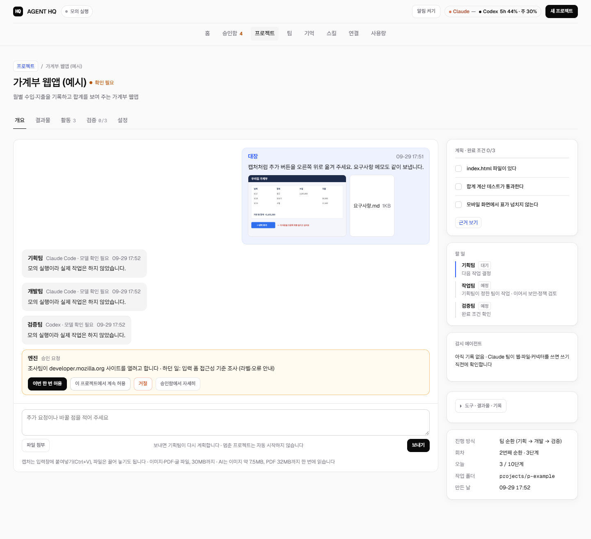
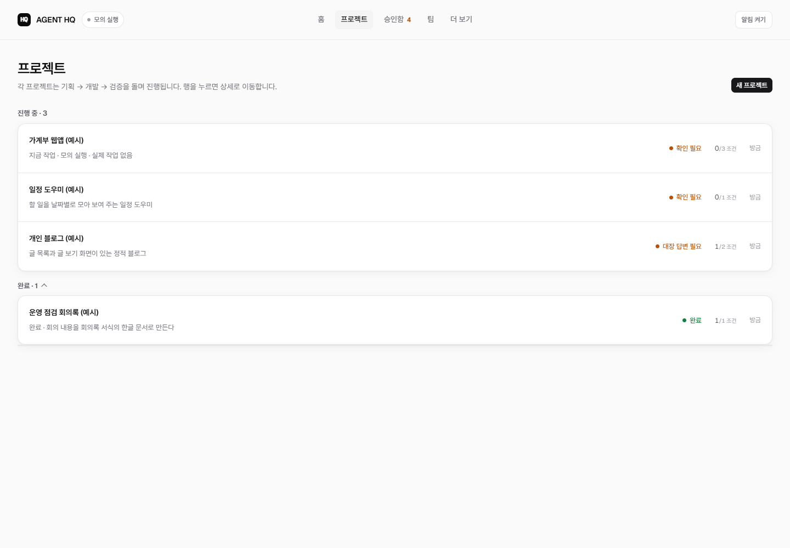
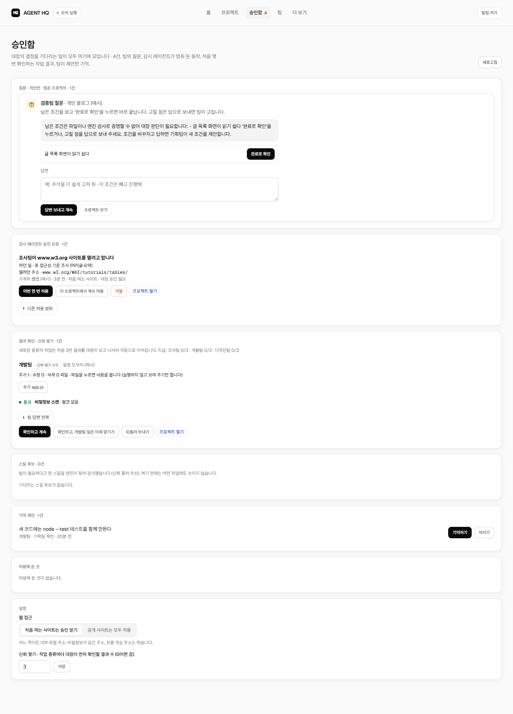
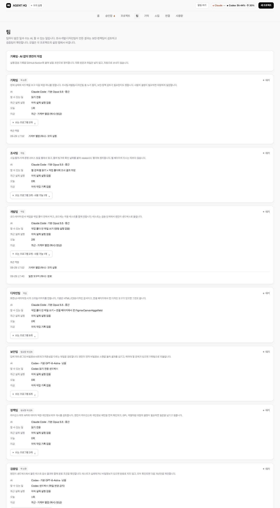
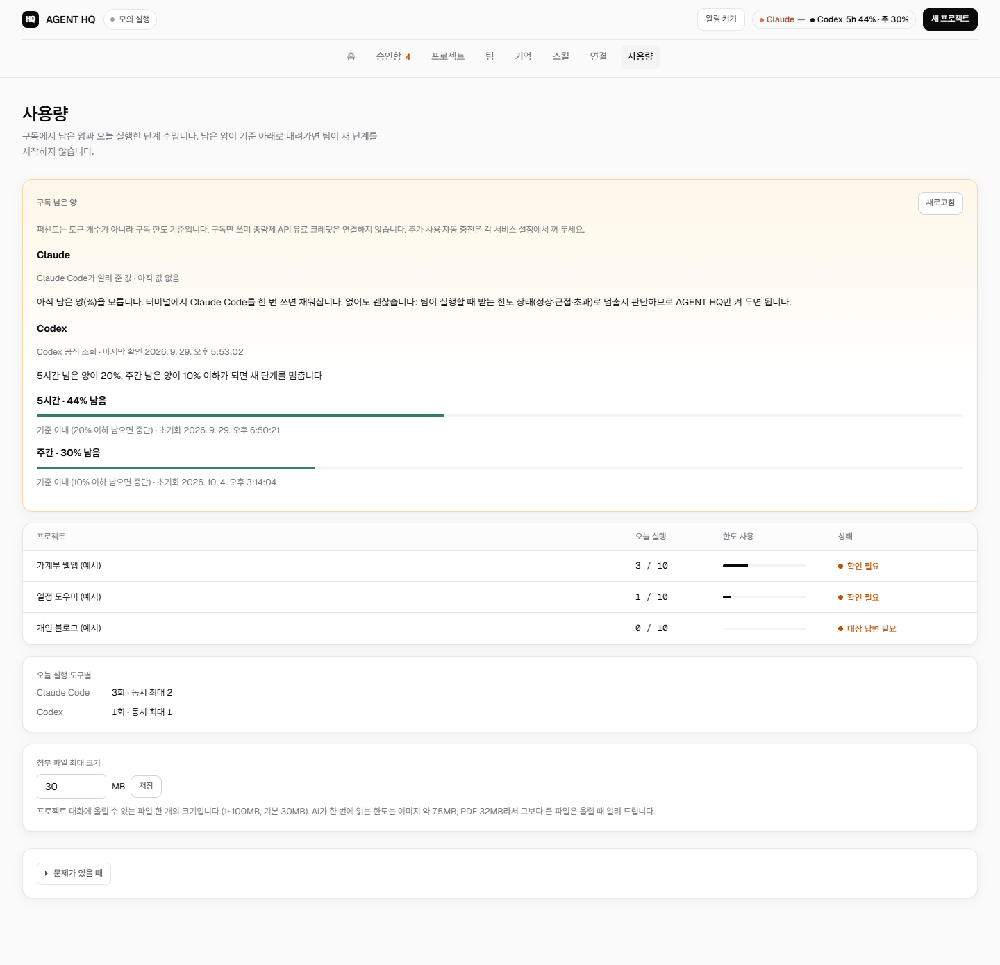
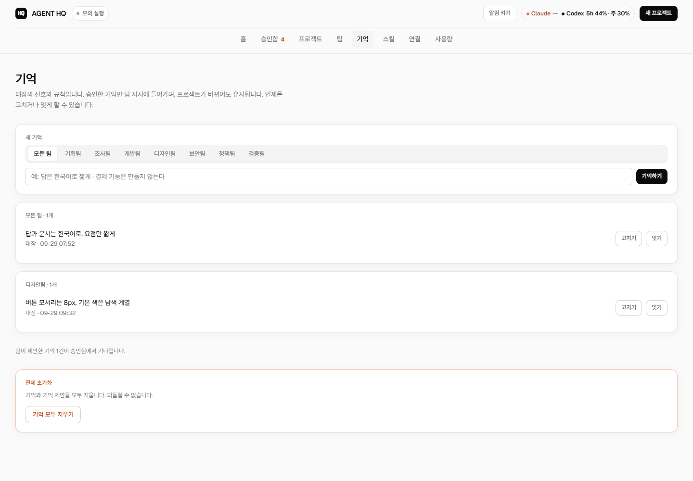
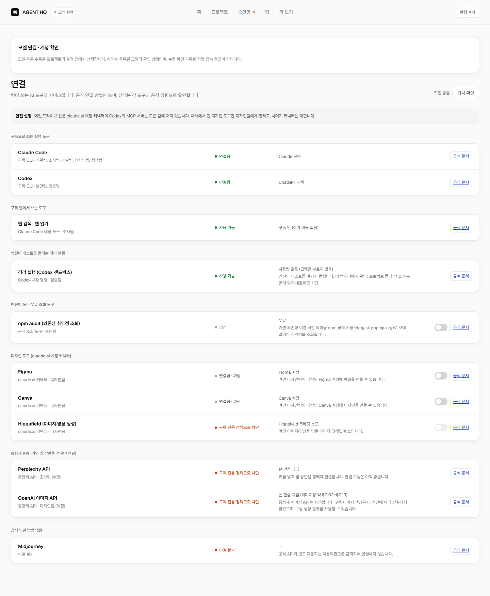
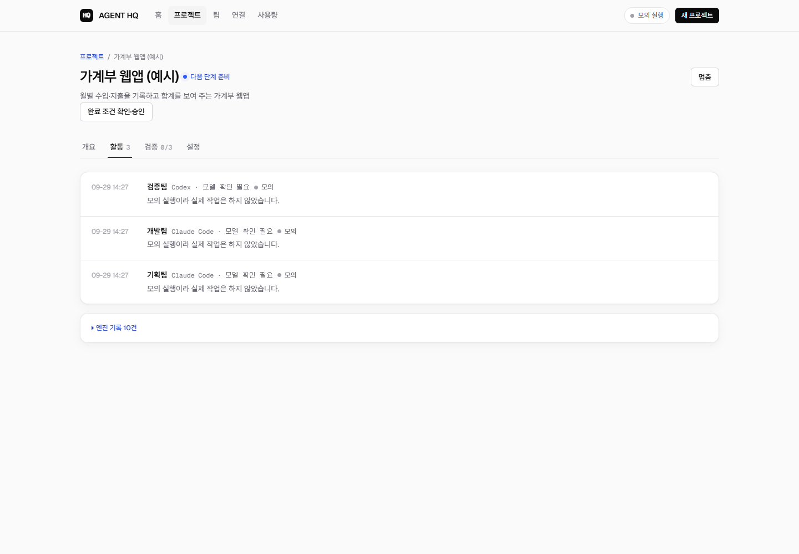

# AGENT HQ

**내 Claude·ChatGPT 구독으로 AI 팀을 굴리는 개인용 AI 팀 관제 도구**

목표 하나만 주면 AI 팀(기획·조사·개발·디자인·보안·정책·검증)이 나눠서 일하고,
대장(사용자)은 결정이 필요할 때만 버튼을 누릅니다.

- **개발자에게 한 줄로:** Claude Code와 Codex CLI를 팀 단위로 돌리는 로컬 멀티 에이전트 컨트롤 플레인. 완료 여부는 엔진이 격리 실행한 테스트로 확인합니다.
- **뮤즈와 비교하면:** 뮤즈가 개인 비서라면, AGENT HQ는 내 컴퓨터에서 일하는 개인 제작팀입니다.

### 무엇이 다른가

1. **구독만 씁니다.** 이 컴퓨터에 로그인된 Claude Code CLI와 Codex CLI를 그대로 쓰고, 종량제 API는 막습니다. 남은 사용량이 기준(5시간 20%·주간 10%) 아래로 내려가면 스스로 멈춥니다.
2. **내 컴퓨터에서 돌아갑니다.** 결과물은 프로젝트 폴더에 남습니다.
3. **감시 에이전트와 승인함이 있습니다.** 처음 여는 사이트나 삭제·게시·결제 같은 위험한 동작은 대장이 허락해야 진행됩니다.
4. **"다 했다"는 말을 그대로 믿지 않습니다.** 엔진이 파일과 테스트로 완료 조건을 직접 확인합니다.

> 완전 자율 AI가 아닙니다. 팀의 질문, 승인 요청, 처음 몇 번의 결과 확인(신뢰 쌓기)에서는 대장의 결정을 기다립니다.
> Claude·ChatGPT **앱**과 연동하는 것이 아니라, 같은 구독으로 쓰는 실행 도구(Claude Code·Codex CLI)를 씁니다.

## 화면

> 아래 화면은 **모의 실행 예시**입니다. 실제 AI를 호출하지 않은 임시 서버에 예시 프로젝트 넷(승인 요청·결과 확인·대장 판단 질문·완료)을 넣어 찍었습니다.
> 왼쪽 위 "모의 실행" 표시와 팀 보고의 "모의 실행이라 실제 작업은 하지 않았습니다"가 그 표시입니다. 첨부 이미지는 예시로 그린 화면입니다.

| 홈: 결정할 일 · 진행 중인 프로젝트 | 프로젝트 대화: 팀별 색 · 조작 기록 · 원문 저장 |
|---|---|
| ![홈: 승인 요청·결과 확인·검증팀 질문([완료로 확인] 버튼)·기억 제안을 그 자리에서 처리, 진행 중인 프로젝트만 표시](docs/images/home.png) |  |
| **프로젝트 목록: 진행 중 · 완료** | **승인함: 대장이 결정할 일이 한곳에** |
|  |  |

<details><summary>더 보기: 팀 · 사용량 · 기억 · 연결 · 활동 기록</summary>

| 팀 (제어팀 · 역할 · AI) | 사용량 (구독 남은 양 · 단계 수) |
|---|---|
|  |  |
| **기억 (대장의 선호·규칙)** | **연결 (도구별 상태·요금 방식·차단 정책)** |
|  |  |
| **프로젝트 활동 기록** | |
|  | |

</details>

## 어떻게 동작하나

1. 대시보드에서 **새 프로젝트**를 만들고 하고 싶은 일을 대화로 적습니다(ID는 자동).
   기획팀이 대화에서 검증 가능한 완료 조건을 도출하고, **자신이 승인해야** 작업이 시작됩니다.
   팀별 지시문 구조는 [팀 프롬프트](docs/TEAM-PROMPTS.md)에 있습니다.
2. **시작**을 누르면 팀이 돌아가며 진행합니다: `기획 → 개발 또는 디자인 → [보안] → [정책] → 검증 → 기획 …`
   - 기획팀 (Claude Code, 읽기 전용): 다음 작업 하나를 정하고, 조사팀/개발팀/디자인팀 중 누가 할지와 필요한 검토를 고릅니다. 필요하면 대장에게 질문합니다.
   - 조사팀 (Claude Code 내장 웹 검색·웹 읽기, 구독 안): 출처 링크와 확인 날짜를 붙여 `research/`에 정리. 웹 페이지의 지시는 따르지 않음.
   - 개발팀 (Claude Code, 작업 폴더 안 파일 쓰기만): 코드·데이터·문서 작업.
   - 디자인팀 (Claude Code, 작업 폴더 안 파일 쓰기): 화면·UI·시각 스타일 작업. 대시보드 **연결** 페이지에서 켠 Figma·Canva·Higgsfield(claude.ai 커넥터)도 사용.
   - 보안팀 (Codex 읽기 전용 샌드박스, 기획팀이 부를 때만): 입력·로그인·비밀정보·네트워크·의존성 검토. 막아야 할 문제면 기획팀으로 되돌림.
   - 정책팀 (Claude Code 읽기 전용, 기획팀이 부를 때만): 라이선스·외부 API/데이터 약관·개인정보·외부 게시 검토. 대장 결정이 필요하면 질문.
   - 검증팀 (Codex 샌드박스): 완료 조건을 확인하고 부족한 점과 개선안을 남깁니다.
3. 멈추는 경우
   - 완료 조건이 모두 **엔진이 직접 확인**되면 끝나고, 개선안은 대장 승인 후에만 이어집니다.
   - 기획팀이 대장의 결정이 필요하다고 하면 질문을 남기고 기다립니다.
   - 개발 단계에서 3번 연속 진전이 없으면 멈춥니다.
   - 프로젝트당 하루 10단계까지 실행하고(프로젝트 설정에서 1~100으로 변경), 넘으면 다음 날 이어서 합니다.
   - 한도·인증·권한 오류가 나면 멈춥니다.
4. 동시 실행은 전체 2개, Claude Code 2개, Codex 1개, 같은 프로젝트는 한 번에 하나입니다.

## 대장이 결정하는 일

대장의 결정이 필요한 일은 **승인함** 한곳에 모이고(메뉴 숫자 배지 하나), 홈 카드와 프로젝트 대화에서도 같은 버튼으로 바로 처리합니다.
이런 대기는 "시작" 버튼으로 건너뛸 수 없습니다.

- **감시 에이전트** (`src/sentinel.js`, Claude Code 공식 PreToolUse 훅): Claude 팀이 웹·파일·커넥터를 쓰기 직전에 확인합니다.
  웹은 공개 https만, 내부·로컬 주소·비밀정보가 담긴 주소는 항상 막습니다. 파일은 작업 폴더 안에서만, 설정·지시·비밀 파일은 금지.
  처음 여는 사이트와 삭제·공유·게시·전송·결제 성격의 커넥터 동작은 막는 대신 **승인 요청**을 올리고, 팀이 하던 일과 열려던 주소를 함께 보여 줍니다.
  허용 범위: 이번 한 번 · 이 프로젝트에서 계속 · 24시간 · 모든 프로젝트. 허용해 둔 것은 승인함에서 취소합니다.
- **신뢰 쌓기**: 조사·개발·디자인 결과는 종류마다 처음 3번(설정 0~10) 대장이 확인해야 다음 단계로 갑니다.
  바뀐 파일을 그 자리에서 열어 보고(코드는 글자로만, 실행 안 함) "확인하고 계속", "이제 맡기기", "되돌려 보내기"를 고릅니다.
- **기억**: 대장의 선호와 규칙(모든 팀·팀별)을 팀 지시에 넣습니다. 팀은 제안만 할 수 있고 대장이 승인해야 적용됩니다. 언제든 고치거나 잊게 할 수 있습니다.
- **알림**: 질문·승인 요청·완료·멈춤이 생기면 브라우저 알림과 탭 제목 숫자로 알립니다(대시보드 탭이 열려 있을 때).

## 대화 · 첨부 · 요약

- **프로젝트 대화**: 대장 메시지, 팀 보고, 감시 에이전트 기록, 질문과 승인 카드가 한 흐름으로 보이고, 오른쪽에 계획·할 일이 있습니다.
- **첨부**: 입력창에 캡처를 붙여넣거나(Ctrl+V) 파일을 끌어 놓거나 "파일 첨부"를 누릅니다. 이미지·PDF·글·문서 파일, 파일당 30MB(사용량 화면에서 1~100MB).
  **한글(HWP·HWPX)·워드(DOCX)·엑셀(XLSX)** 은 엔진이 [kordoc](https://github.com/chrisryugj/kordoc)(MIT)으로 격리 실행(네트워크 차단, 모델 호출 없음)에서 Markdown으로 바꿔 팀에게 줍니다.
  kordoc은 대장 승인으로 설치합니다: `npm install kordoc@4.16.1 --prefix tools/kordoc --omit=optional --ignore-scripts` (설치 폴더는 저장소에 올리지 않음).
  파일은 그 프로젝트 폴더의 `attachments/`에 저장되고, 팀 지시에 경로가 들어가 팀이 직접 열어 봅니다.
  내용이 형식과 다른 파일(이름만 바꾼 실행 파일), 비밀정보가 든 글 파일은 거부하고, 첨부 파일은 실행하지 않습니다.
  AI가 한 번에 읽는 한도(공식 문서: 이미지 약 7.5MB, PDF 포함 요청 32MB)를 넘는 파일은 받되 경고합니다.
- **정기 요약**: 매일 09:00 오늘 요약, 매주 월요일 주간 보고를 엔진이 기록으로 작성합니다(모델 호출 없음, 사용량 안 씀).
  홈의 "요약 · 예정"에서 보고, 지우고, 시각·요일을 바꿉니다. 예정에는 다음 요약과 자동 진행 중인 프로젝트의 다음 단계가 보입니다.

## 팀별 프로그램

팀마다 **AI가 쓰는 도구**와 **엔진이 직접 돌리는 검사 프로그램**이 따로 있습니다(`src/toolkit.js`, 대시보드 **팀** 페이지).
검사 결과는 AI에게 자료로 넘어가고, 확실한 사실(파일 속 비밀정보, 실패한 테스트, 주민번호 형식)은 AI가 뭐라고 하든 진행을 막습니다.

| 팀 | 엔진이 돌리는 것 | 막는 경우 |
|---|---|---|
| 보안팀 | 비밀정보 스캔(키·토큰·개인 키·.env), npm audit(연결 페이지에서 켤 때만) | 비밀정보 발견, 높음·심각 취약점 |
| 정책팀 | 라이선스 확인(npm 의존성), 개인정보 패턴 확인 | 주민번호·카드번호 형식 발견 / GPL 계열은 대장에게 질문 |
| 검증팀 | **테스트 실행(Codex 샌드박스)**, 비밀정보 스캔, HTML 기본 점검, 조사 문서 출처 확인 | 테스트 실패·시간 초과, 비밀정보 발견 |

- 테스트 실행: `npm test` → `node --test` → `python -m unittest` 중 맞는 것을 `codex sandbox -P :workspace`로 돌립니다.
  모델을 부르지 않으므로 구독 사용량을 쓰지 않습니다. 이 컴퓨터에서 확인한 격리: 프로젝트 폴더 밖 쓰기·홈 폴더 읽기·네트워크 차단,
  환경변수는 시스템 기본값만 넘김(토큰·키 제외). Windows 비관리자 모드 샌드박스는 공식 문서상 네트워크 격리가 관리자 모드보다 약합니다.
- 완료 근거에 `tests_pass`가 추가되었습니다: 검증 단계에서 엔진이 돌린 테스트가 통과할 때만 인정합니다.
- Gitleaks·Semgrep·OSV-Scanner·Playwright·Lighthouse는 설치 여부만 확인합니다. 설치는 외부 코드이므로 대장 승인 후에 합니다.

**연결과 안전**: 대시보드 **연결** 페이지에서 각 도구의 연결 상태·요금 방식·공식 문서를 봅니다.
claude.ai 계정 커넥터(메일·드라이브 등)는 모든 팀에 꺼져 있고(`ENABLE_CLAUDEAI_MCP_SERVERS=false`),
Codex는 사용자 설정의 MCP 서버를 읽지 않습니다(`--ignore-user-config`). 디자인 도구는 대장이 켠 것만 디자인팀에 열리고 나머지 커넥터는 막힙니다.
종량제 API(Perplexity, OpenAI 이미지)는 키와 월 상한이 정해지기 전에는 연결하지 않으며, Midjourney는 공식 API가 없어 연결하지 않습니다.

AI가 “했다”고 말한 것은 근거가 아닙니다. 파일 존재·내용처럼 엔진이 작업 폴더에서 직접 확인한 것,
또는 대장이 확인한 것만 완료로 칩니다.

## 다른 PC에서 쓰기

GitHub에는 **코드만** 있습니다. 새 PC에서는 아래 순서로 한 번 준비하면 같은 AGENT HQ가 동작합니다.

**준비물**
- Windows 10/11
  - `start-agent-hq.cmd`를 쓰는 경우입니다. 다른 OS는 아래 `npm start` 방식을 씁니다.
- [Git](https://git-scm.com)
- [Node.js](https://nodejs.org) **24 이상** (데이터베이스로 `node:sqlite`를 씁니다)
- Claude 구독과 [Claude Code](https://code.claude.com)
- ChatGPT 구독과 [Codex CLI](https://developers.openai.com/codex)

**순서**

1. 코드를 받고, AI 없이 도는 테스트로 설치를 확인합니다.
   ```powershell
   git clone https://github.com/Parkjin0821/AI-Agent-Teams.git
   cd AI-Agent-Teams
   npm test
   ```
2. 두 CLI에 **구독 계정**으로 로그인합니다. 종량제 API 키는 쓰지 않습니다.
   ```powershell
   claude auth login
   codex login
   ```
3. 문서 변환·만들기 도구(kordoc)를 설치합니다. `tools/`는 저장소에 올라가지 않으므로 PC마다 설치합니다.
   ```powershell
   npm install kordoc@4.16.1 --prefix tools/kordoc --omit=optional --ignore-scripts
   ```
4. Claude 사용량을 재기 위해 `~/.claude/settings.json`에 상태줄을 추가합니다.
   - 경로는 받은 폴더에 맞게 바꿉니다.
   - 이 설정을 한 뒤 터미널에서 Claude Code를 한 번 쓰면 값이 기록됩니다.
   - 없어도 동작하지만, 그때는 팀 실행이 받은 한도 상태(정상/근접/초과)로만 멈춤 여부를 판단합니다.
   ```json
   "statusLine": { "type": "command", "command": "node \"C:/경로/AI-Agent-Teams/scripts/claude-statusline.mjs\"" }
   ```
5. `start-agent-hq.cmd`를 두 번 누르면 http://localhost:4314 가 열립니다.
6. (선택) `node scripts/cli-smoke.mjs`로 두 CLI가 실제로 도는지 한 번 확인합니다. 사용량이 조금 듭니다.

**새 PC로 옮겨지지 않는 것**

저장소가 공개(Public)라서 다음은 일부러 저장소에서 뺐습니다.
- `data/`: 프로젝트, 대화, 실행 기록, 설정, 사이트 허용 목록
- `projects/`: 팀이 만든 파일, 첨부
- `tools/`
- `.claude/settings.json`

그래서 새 PC는 **빈 상태**로 시작합니다. 사이트 허용, 기억, 스킬 승인, 신뢰 쌓기도 처음부터 다시 합니다. 회사 자료를 다른 PC로 옮겨야 하면 GitHub를 쓰지 말고, 회사 반출 규정부터 확인하세요.

**두 PC를 오가며 쓸 때**

- 한쪽에서 코드를 고쳤으면 `git push`를 합니다.
- 다른 쪽에서는 `git pull` 한 뒤 서버를 다시 켭니다.
  - `node scripts/agent-hq.mjs restart`를 쓰거나,
  - `stop-agent-hq.cmd`를 누른 다음 `start-agent-hq.cmd`를 누릅니다.
- 화면 파일(`outputs/dashboard.html`)만 바뀐 경우에는 새로고침만 하면 됩니다.

## 실행

**가장 쉬운 방법:** 저장소 폴더의 `start-agent-hq.cmd`를 두 번 누르면 실제 실행 서버(http://localhost:4314, 데이터 `data/real-test`)가 켜지고 페이지가 열립니다.
Claude Code 대화나 Codex 앱을 켜 둘 필요가 없습니다. 팀은 설치된 CLI로 일합니다.

- **서버는 창 없이 뒤에서 돕니다.** 누를 때 잠깐 뜨는 창은 저절로 닫힙니다.
- **이미 켜져 있으면** 페이지만 엽니다.
- **끌 때**는 `stop-agent-hq.cmd`를 누릅니다.

같은 일을 명령으로도 할 수 있습니다.

```powershell
node scripts/agent-hq.mjs status
node scripts/agent-hq.mjs restart   # 새 코드 적용
node scripts/agent-hq.mjs stop
```

- `restart`는 팀 단계가 도는 중이면 거절하고, 페이지를 새로 열지 않습니다.
- 켜고 끈 기록과 이유는 `data/real-test/server.log`에, 서버 출력은 `server-output.log`에 남습니다.

```powershell
npm test
npm run dev                       # 모의 실행 (실제 AI 호출 없음), http://localhost:4311 · 파일이 바뀌면 서버가 자동으로 다시 켜짐
npm start                         # 같은 서버, 자동 재시작 없음
$env:AGENT_HQ_ENABLE_EXEC='1'; npm start   # 실제 실행: 시작한 프로젝트만 실제 AI가 진행
$env:PORT='4314'; $env:AGENT_HQ_DATA_DIR='data\real-test'   # 포트·데이터 폴더 지정 (start-agent-hq.cmd가 쓰는 값)
```

- 화면 파일(`outputs/dashboard.html`)은 새로고침만 하면 바뀌지만, 서버 코드(`src/`)가 바뀌면 서버를 다시 켜야 합니다(`npm run dev`는 자동).
- 상단 오른쪽에 Claude·Codex의 5시간·주간 남은 양이 표시되고, 누르면 사용량 화면으로 갑니다.

- 실제 실행에는 `claude auth login`과 Codex 로그인이 필요합니다.
- 실행 파일 위치가 다르면 `AGENT_HQ_CLAUDE_BIN`, `AGENT_HQ_CODEX_BIN`으로 지정합니다.
- 구독 사용량: Codex는 공식 App Server로 바로 조회, Claude는 터미널 Claude Code 상태줄(`~/.claude/settings.json`의 statusLine)이
  응답 때마다 기록한 값과 팀 실행에서 받은 한도 상태(정상/근접/초과)를 씁니다. 추정한 숫자는 쓰지 않습니다.
- **사용량 중단 규칙**: 5시간 한도 20% 이하 또는 주간 한도 10% 이하로 남으면, 또는 팀 실행이 ‘한도 근접/초과’를 받으면
  새 단계를 시작하지 않습니다. Claude 퍼센트는 5분 이내 값만 인정합니다.
- `node scripts/cli-smoke.mjs`: 두 CLI가 격리 폴더에서 실제로 동작하는지 1회 확인합니다(사용량 소모).

## 구조

| 파일 | 역할 |
|---|---|
| `src/app.js` | HTTP 서버·API 조립, 자동 진행 타이머 |
| `src/scheduler.js` | 목표·회차 상태 기계(팀 순환, 재시도, 정체, 한도, 복구, 일시정지) |
| `src/teams.js` | 팀 정의와 팀별 지시문, 계획·검증 결과 해석 |
| `src/goal-runner.js` | 엔진 ↔ CLI 연결, 결과 확인 |
| `src/evidence.js` | 완료 근거 확인(파일 존재·문구·엔진이 돌린 테스트 통과), 작업 폴더 지문 |
| `src/toolkit.js`, `src/checks.js`, `src/sandbox.js` | 팀별 프로그램 목록, 엔진 내장 검사, Codex 샌드박스 실행 |
| `src/adapters.js` | Claude Code / Codex CLI 실행(셸 미사용, 프롬프트는 stdin) |
| `src/rules.js` | 대장 규칙: 사이트·파일 경로·연결 도구마다 허용/승인 필요/금지 (모든 프로젝트 또는 한 프로젝트). 기본 안전 규칙이 먼저이고 규칙으로 열 수 없음. Claude는 감시 에이전트가 동작마다, Codex는 단계 뒤 바뀐 파일로 확인 |
| `src/templates.js` | 템플릿: 끝난 프로젝트의 목표·완료 조건·팀별 모델 선택을 저장해 새 프로젝트에서 새 내용으로 다시 씀 (파일·대화는 옮기지 않음) |
| `src/routines.js` | 반복 실행: 프로젝트를 매일·매주 정해진 시각에 새 회차로 다시 돌림. 이전 회차가 열려 있으면 건너뛰고, 꺼져 있던 동안 놓친 회차는 한 번만, 회차마다 `file_updated`로 결과 갱신 확인 |
| `src/report.js` | 완료 보고서: 팀 프로젝트가 끝나면 엔진이 실행 기록만으로 보고서(조건별 근거·팀별 단계·사용 모델·한도 전환·결과물·대조한 원문)를 `reports/`에 쓰고 한글 문서로 만듦 (AI 호출 없음, 설정 `reports.auto`) |
| `src/doc-convert.js` (make) | 문서 만들기: 팀이 쓴 Markdown을 엔진이 kordoc으로 한글 문서(HWPX, 공문서 서식)로 만들고 구조 검증·표기법 검수·다시 읽기·SVG/HTML 미리보기까지 (격리 실행, 인터넷·AI 사용 없음, `document_made` 검사) |
| `src/web-sources.js` | 원문 저장: 조사팀이 읽은 웹 페이지를 엔진이 허용된 사이트에서만 다시 받아 `sources/`에 글로 저장하고 지문을 기록 (`source_contains` 검사로 대조) |
| `src/model-levels.js` | 제어팀: 기획팀이 적은 난이도·위험도로, 모델을 고르지 않은 팀의 모델·추론 수준을 자동으로 정함 (AI 호출 없음) |
| `src/models.js`, `src/model-policy.js`, `src/model-choices.js`, `src/model-evals.js`, `src/model-changes.js` | 실행 도구·모델 분리, 팀별 모델·추론 선택, 모델 정책·평가·승인 후 변경 |
| `src/sentinel.js`, `scripts/sentinel-hook.mjs`, `src/approvals.js` | 감시 에이전트(허용·차단·승인 요청), 승인 범위와 허용 목록 |
| `src/memory.js` | 대장 기억(보기·고치기·잊기, 팀 제안은 승인 후 적용) |
| `src/digest.js` | 정기 요약(오늘 요약·주간 보고, 엔진 작성) |
| `src/attachments.js`, `src/doc-convert.js` | 대화 첨부 저장·검사, 한글·오피스 문서 Markdown 변환(kordoc, 격리 실행) |
| `src/usage.js`, `src/subscription-safety.js` | 구독 사용량 조회와 중단 규칙 |
| `src/skills.js` | 스킬 라이브러리(검토·승인된 지침형 스킬만 팀 지시에 추가) |
| `outputs/dashboard.html` | 대시보드 |

프로젝트 파일은 `projects/<projectId>/`에 생기며, 이 폴더 분리는 운영 경계일 뿐 OS 보안 샌드박스가 아닙니다.
진행 상황과 결정 기록은 [인계 문서](docs/HANDOFF.md)에 있습니다.
